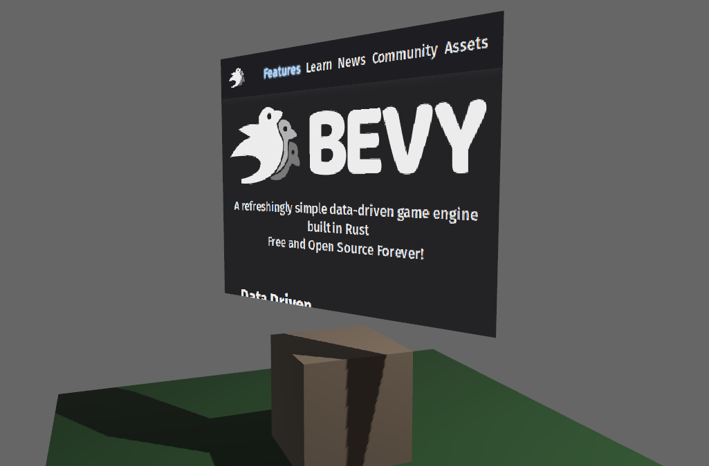

# 3D

This is a quickstart for 3D webview. See also [2D/UI mode](quickstart.md)



Add imports:

```rust
# extern crate bevy_webview;
use bevy_webview::prelude::*;
```

Add the plugin to Bevy App:

```rust
# extern crate bevy;
# extern crate bevy_webview;
# use bevy::prelude::*;
# use bevy_webview::prelude::*;
App::new()
    // initializations...
   .add_plugin(WebviewPlugin::with_engine(webview_engine::headless));
```

Make sure that you have a perspective camera in the scene. Remember to add light as well.

```rust
# extern crate bevy;
# use bevy::prelude::*;
fn setup(mut commands: Commands) {
    commands.spawn_bundle(PerspectiveCameraBundle {
        transform: Transform::from_xyz(-2.0, 2.5, 5.0)
            .looking_at(Vec3::new(0.0, 2.0, 0.0), Vec3::Y),
        ..Default::default()
    });
}
```

Finally, spawn the Webview:

```rust
# extern crate bevy;
# extern crate bevy_webview;
# use bevy::prelude::*;
# use bevy_webview::prelude::*;
fn setup(mut commands: Commands) {
    commands.spawn_bundle(WebviewBundle {
        webview: Webview {
            url: Some(String::from("https://bevyengine.org/")),
            ..Default::default()
        },
        transform: Transform {
            translation: Vec3::new(0.0, 2.5, 0.0),
            rotation: Quat::from_rotation_y(-std::f32::consts::PI / 2.0),
            ..Default::default()
        },
        ..Default::default()
    });
}
```

More examples at [examples](https://github.com/blaind/bevy_webview/examples/).
