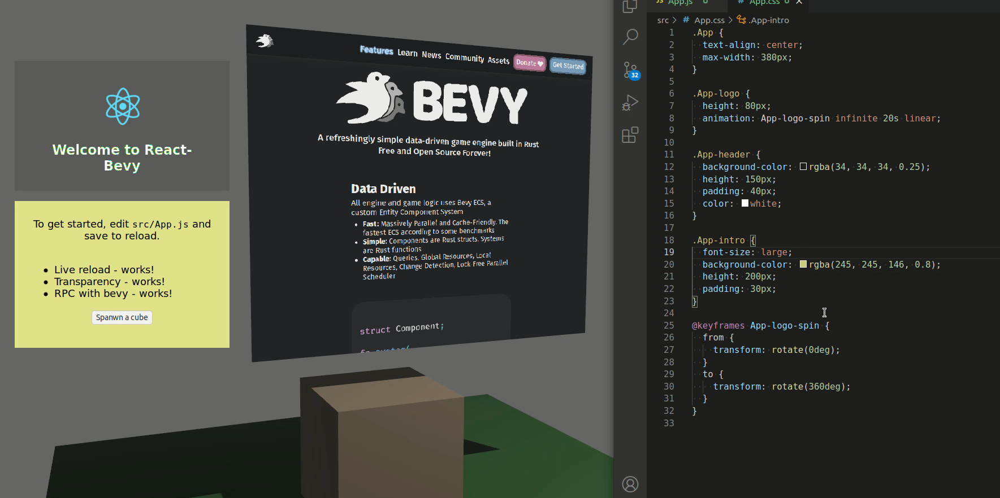

# Bevy Webview Book

[bevy_webview](https://github.com/blaind/bevy_webview) is an experimental webview integration for Bevy game engine for rapidly iterating and building UI's using existing web-technogies and skillsets.

## Use cases

- **Menus, about pages, etc.**: In current state, webviews are good for menus, about pages, and other views that are updated maximum a few times a second

- **Pre-native iteration**: Webviews are a good starting ground when experimenting the app/game design. Eventually, after landing a visually desired state, it is possible to continue by converting to native UI's.

### Benefits?

- **Faster iteration speed**: with instant reloading of webviews, it is possible to see the UI changes almost immediately. This is a lot faster iteration compared to compiled workflows. Seconds waiting add up quickly.

- **Reuse of existing web-based technologies**: use tried-and-tested web technologies for developing the UI. Existing skillsets apply. Easier co-operation between game software developers and UI designers.

### Disadvantages?

- **Lower performance**: using a webview is inherently slower, and it is probably never possible to reach near-native speeds with the webview technology. Current implementation of `bevy_webview` is not recommended for use cases where the webview changes for every frame. See [performance](performance.md)

- **Larger memory footprint**: browsers are complex software. Using a webview in your application will increase memory usage in the range of 50 - 150MB.

- **Narrower cross-platform support**: currently, only Linux and Windows are supported. See [engines](engines.md).
