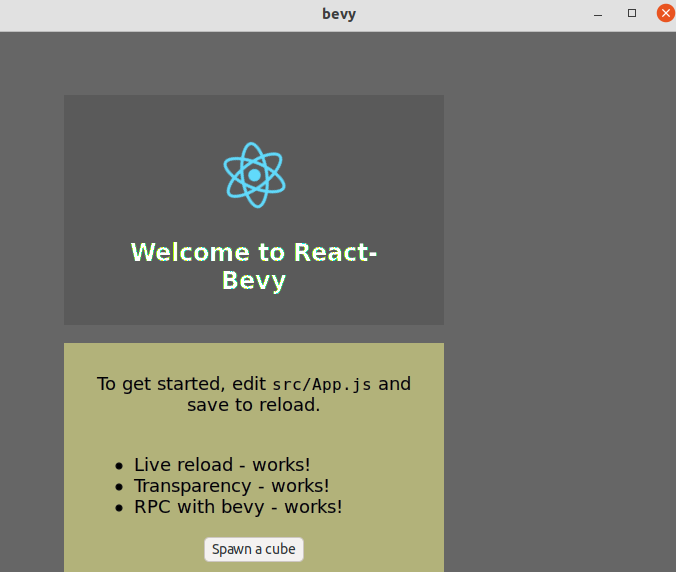

# Quickstart (UI mode)

This is a quickstart for UI/2D webview. See also [3d mode](3d.md)



Add imports:

```rust
# extern crate bevy_webview;
use bevy_webview::prelude::*;
```

Add the plugin to Bevy App:

```rust
# extern crate bevy;
# extern crate bevy_webview;
# use bevy::prelude::*;
# use bevy_webview::prelude::*;
App::new()
    // initializations...
   .add_plugin(WebviewPlugin::with_engine(webview_engine::headless));
```

For various engines, see [engines](engines.md) -section.

Make sure that you have UI camera in the scene:

```rust
# extern crate bevy;
# use bevy::prelude::*;
fn setup(mut commands: Commands) {
    commands.spawn_bundle(UiCameraBundle::default());
}
```

Finally, spawn the Webview:

```rust
# extern crate bevy;
# extern crate bevy_webview;
# use bevy::prelude::*;
# use bevy_webview::prelude::*;
fn setup(mut commands: Commands) {
    commands.spawn_bundle(WebviewUIBundle {
        webview: Webview {
            url: Some(String::from("https://bevyengine.org/")),
            ..Default::default()
        },
        style: Style {
            size: Size::new(Val::Percent(80.0), Val::Percent(80.)),
            margin: Rect::all(Val::Auto),
            justify_content: JustifyContent::Center,
            align_items: AlignItems::Center,
            ..Default::default()
        },
        ..Default::default()
    });
}
```

More examples at [examples](https://github.com/blaind/bevy_webview/examples/).
